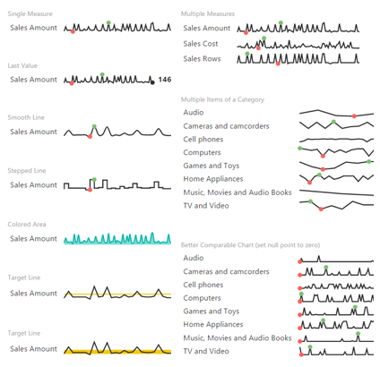

# Sparkline for Power BI
by OKViz

This visual allows you to represent the trend of multiple measures or category items over a line. It takes great care to the use of real estate and includes several useful options: for example, you can display the highest/lowest data points, the last value (or the sum of the values in the series or the average value), a target line/area, and you can change the chart color, the line appearance, and more.

Find out more on http://okviz.com/sparkline/

### Copyrights

Copyright (c) 2016 OKViz - trademark of SQLBI Corp.

See the [LICENSE](/LICENSE) file for license rights and limitations (MIT).